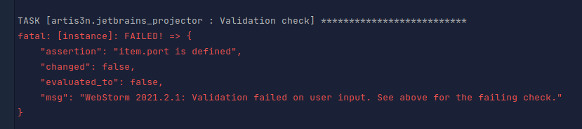

# artis3n.jetbrains_projector

[](https://galaxy.ansible.com/artis3n/jetbrains_projector)
[](https://github.com/artis3n/ansible-role-jetbrains-projector/actions/workflows/ci.yml)
[](https://github.com/artis3n/ansible-role-jetbrains-projector/releases)


[](https://github.com/sponsors/artis3n)
[](https://github.com/artis3n/)
[](https://twitter.com/Artis3n)

This role installs and configures [Jetbrains Projector](https://lp.jetbrains.com/projector/) IDEs leveraging Jetbrains' [projector-installer](https://github.com/JetBrains/projector-installer) command.

Supported operating systems:
- Ubuntu
- Debian
- CentOS / RedHat
- Amazon Linux 2

Note: While Projector and Jetbrains IDEs support ARM servers, the two together are "not well tested" by Jetbrains, so you may experience [issues](https://youtrack.jetbrains.com/issue/PRJ-160) running IDEs on ARM, which are outside the scope of this role.

# Prerequisites

## Python 3

This role requires Ansible to be invoked under Python 3.
It's 2021, y'all.
`ansible_python_interpreter` must be set to some Python 3 path (e.g. `/usr/bin/python3`).

for example, in `inventory`:

```ini
127.0.0.1 ansible_connection=local ansible_user=ec2-user ansible_python_interpreter=/usr/bin/python3
```

# Example Playbook

Minimal setup:

```yml
- name: Playbook
  hosts: all
  roles:
    - role: artis3n.jetbrains_projector
      vars:
        ides:
          - name: WebStorm 2021.2.3
            port: 9876
```

Uninstall:

```yml
- name: Playbook
  hosts: all
  roles:
    - role: artis3n.jetbrains_projector
      vars:
        ides:
          - name: WebStorm 2021.2.3
            # Even if you are uninstalling, you must still specify the port on which the IDE was previously installed
            port: 9876
            state: absent
```

Complete example:

```yml
- name: Playbook
  hosts: all
  roles:
    - role: artis3n.jetbrains_projector
      vars:
        ides:
          - name: WebStorm 2021.2.3
            port: 9876

          - name: GoLand 2021.2.4
            port: 9999
            config: mygoland
            address: 127.0.0.1
            restricted_access_hostnames: 100.101.102.103,127.0.0.1
            required_connection_password: mypass
            update_channel: 2

          - name: IntelliJ IDEA Ultimate 2021.2.3
            port: 9000
            # If you use a custom config name, you **must** include it when uninstalling to uninstall the correct IDE
            config: myintellij
            state: absent
```

# Variables

The only top-level variable is `ides`, which is a list of IDEs to install.

```yml
vars:
  ides: []
```

```yml
vars:
  ides:
    - name: WebStorm 2021.2.1
      port: 9876
```

All following options are variables inside the individual IDE configurations.
**Each IDE must minimally include `name` and `port`**.

## Required

### name

The name of the IDE to install.
This must be the exact version string, e.g. `IntelliJ IDEA Ultimate 2021.2.3`.

The best way I've found to determine valid IDE names is to install `projector-installer` locally and use the `ide find` command:

```bash
pip3 install projector-installer --user

projector ide find <ide>
# e.g.
projector ide find idea
#	   1. Idea_Community
#	   2. Idea_Ultimate
#Choose IDE type or 0 to exit: [0-2]: 2
#Do you want to select from Projector-tested IDE only? [y/N]n
#	   1. IntelliJ IDEA Ultimate 2021.2.3
#	   2. IntelliJ IDEA Ultimate 2021.2.2
#	   3. IntelliJ IDEA Ultimate 2021.2.1
#	   4. IntelliJ IDEA Ultimate 2021.2
#	   5. IntelliJ IDEA Ultimate 2021.1.3
#	   6. IntelliJ IDEA Ultimate 2021.1.2
#	   7. IntelliJ IDEA Ultimate 2021.1.1
#	   8. IntelliJ IDEA Ultimate 2021.1
# ...
```

Any IDE version is allowed in this role.
Jetbrains only tests certain IDEs for complete compatibility with a Projector server.
I haven't noticed an issue using non-certified versions and the UX was too clunky to ask end users to toggle whether they want a fully compatible version.
So this value accepts any IDE string.

If you want to be certain you are using a fully-compatible IDE version, pick a `name` from Jetbrains' supported list [here][compatible IDEs].

### port

The port on which the IDE should listen.

e.g. if you set `port: 9000` then the IDE will be available at `http://<your_hostname>:9000/`.

You must have a different port for each IDE or the role will fail to successfully start one of the IDEs.

## Optional

### config

The name of the config file to use when installing an IDE.

Think of the config file as the unique identifier for an IDE installation.
You may install the same IDE multiple times as long as you use unique config names.

By default, this is the first word in the `name` of the IDE.

e.g.

```yml
name: IntelliJ IDEA Ultimate 2021.2.1
config: IntelliJ
```

You do not need to customize the `config` value unless you are installing multiple versions of the same IDE on the target system.
Or, if you prefer to customize them to some pattern.

### state

Whether to install an IDE or uninstall a previously configured IDE.

Must be one of: `absent`, `present`.
Defaults to `present`.

### address

The address or hostname from which the IDE should listen from.

Defaults to `*`.

Example: `address: myide.mywebsite.com`.

### restricted_access_hostnames

A comma-separated list of hostnames that are allowed to access the IDE.
The IDE will refuse connections from any hostname not included in this list.

Defaults to `0.0.0.0`.

Example: `restricted_access_hostnames: 100.101.102.103,127.0.0.1`

### required_connection_password

A query string password required for successful connections to IDE.
By default, no connection password is required.

If set, the IDE will refuse connections from URLs missing the `token` query parameter with the correct value.

e.g. `http://127.0.0.1:9000/?token=mypass`

### update_channel

- `1` - IDEs tested specifically for compatibility with Projector.
- `2` - all IDE versions.

Defaults to `2` by default.
If you would like to enforce full compatibility with Projector, set this value to `1`.
Note that IDE installation may fail in weird ways if you set this option and supply a non-compatible IDE version, so modifying this is not recommended.
See [here][compatible IDEs] for Jetbrains' list of fully compatible IDEs.

# Validation

The role validates user input where possible.
If your pass incorrect input into the role you will be provided a hint as to what is wrong.

e.g. if your IDE is missing the required `port` attribute:



# Dependencies

None

# License

MIT

# Author Information

Ari Kalfus ([@artis3n](https://www.artis3nal.com/)) <dev@artis3nal.com>


[compatible IDEs]: https://github.com/JetBrains/projector-installer/blob/master/projector_installer/compatible_ide.json
